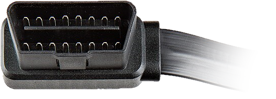

.. title:: Connection Guide

.. meta::
    :description: Connection Guide for py-obdii.
    :keywords: py-obdii, py-obd2, obdii, obd2, quickstart, setup
    :robots: index, follow

.. |contribute-button| replace::

    Untested, help us improve this part of the documentation. :bdg-link-success:`Contribute <https://github.com/PaulMarisOUMary/OBDII/edit/main/docs/source/connection.rst>`

.. _connection:

Connection
==========

This guide explains how to connect the library to different types of OBDII adapters and start communicating with your vehicle.

Understanding Adapters
----------------------

An OBDII adapter is a small physical device that acts as a bridge between your vehicle's diagnostic port and your computer, Raspberry Pi, smartphone, etc..

It plugs into the vehicle's OBDII diagnostic port (female connector), usually found under the dashboard or near the steering wheel, you can check online for your vehicle's exact location.

It converts the car's data signals into a standard format that our library can read.

The image below shows a male OBDII connector, which is the adapter side that plugs into your vehicle's diagnostic port.

.. tip::
    Don't have hardware ? Follow the :ref:`emulator` guide.

Connect your Adapter
--------------------

#. Plug the OBDII adapter into your vehicle's diagnostic port.

#. Turn the ignition to the "ON" position (engine does not need to start).

#. Identify your adapter's connection type.

    Different adapters connect in different ways:

    - **Serial**: :ref:`USB <conn-usb>` and :ref:`Bluetooth <conn-bluetooth>`
    - **Network**: :ref:`WiFi <conn-network>` and :ref:`Ethernet <conn-network>`

.. _conn-usb:

Connecting via USB
^^^^^^^^^^^^^^^^^^

Use this method if your adapter connects via USB cable.

.. tab-set::
    :sync-group: os

    .. tab-item:: Linux
        :sync: linux

        #. Identify the USB serial port:

            .. code-block:: console

                $ dmesg | grep tty

            .. note::

                You can also list available USB serial devices with:

                .. code-block:: console

                    $ ls /dev/ttyUSB*

        #. Chose the correct port from the output (e.g., ``/dev/ttyUSB0``).

        #. Use this port for connecting.
        
            .. dropdown:: Connection example
                :open:
                :chevron: down-up
                :icon: quote

                .. code-block:: python
                    :caption: main.py
                    :linenos:
                    :emphasize-lines: 3

                    from obdii import Connection, at_commands

                    with Connection("/dev/ttyUSB0") as conn:
                        version = conn.query(at_commands.VERSION_ID)
                        print(f"Adapter Version: {version.value}")

    .. tab-item:: Windows
        :sync: windows

        #. Identify the COM port:

            .. code-block:: console

                chgport

            .. note::

                You can also find the COM port in "Device Manager" under "Ports (COM & LPT)".

        #. Chose the corresponding COM port (e.g., ``COM3``).

        #. Use this port for connecting.

            .. dropdown:: Connection example
                :open:
                :chevron: down-up
                :icon: quote

                .. code-block:: python
                    :caption: main.py
                    :linenos:
                    :emphasize-lines: 3

                    from obdii import Connection, at_commands

                    with Connection("COM3") as conn:
                        version = conn.query(at_commands.VERSION_ID)
                        print(f"Adapter Version: {version.value}")
    
    .. tab-item:: macOS
        :sync: macos

        |contribute-button|

.. _conn-bluetooth:

Connecting via Bluetooth
^^^^^^^^^^^^^^^^^^^^^^^^

Use this method if your adapter communicates wirelessly over Bluetooth.

.. tab-set::
    :sync-group: os

    .. tab-item:: Linux
        :sync: linux

        #. Open the Bluetooth control terminal:

            .. code-block:: console

                $ bluetoothctl

        #. Power on Bluetooth, and pair with the adapter:

            .. code-block:: bash

                # Power on and scan
                [bluetooth]# power on
                [bluetooth]# agent on
                [bluetooth]# default-agent
                [bluetooth]# scan on

                # Note the adapter's MAC address (XX:XX:XX:XX:XX:XX)

                # Pair and trust the adapter
                [bluetooth]# pair XX:XX:XX:XX:XX:XX
                [bluetooth]# trust XX:XX:XX:XX:XX:XX
                [bluetooth]# exit

        #. Bind the adapter to an RFCOMM port:

            .. code-block:: console

                $ sudo rfcomm bind /dev/rfcomm0 XX:XX:XX:XX:XX:XX
        
        #. Use the ``/dev/rfcomm0`` port for connecting.

            .. dropdown:: Connection example
                :open:
                :chevron: down-up
                :icon: quote

                .. code-block:: python
                    :caption: main.py
                    :linenos:
                    :emphasize-lines: 3

                    from obdii import Connection, at_commands

                    with Connection("/dev/rfcomm0") as conn:
                        version = conn.query(at_commands.VERSION_ID)
                        print(f"Adapter Version: {version.value}")

    .. tab-item:: Windows
        :sync: windows

        #. Pair the adapter via Bluetooth.

        #. Identify the COM port assigned to the adapter:

            .. code-block:: console

                chgport

            .. note::

                You can also find the COM port in "Device Manager" under "Ports (COM & LPT)".
        
        #. Chose the corresponding COM port (e.g., ``COM7``).

        #. Use this port for connecting.

            .. dropdown:: Connection example
                :open:
                :chevron: down-up
                :icon: quote

                .. code-block:: python
                    :caption: main.py
                    :linenos:
                    :emphasize-lines: 3

                    from obdii import Connection, at_commands

                    with Connection("COM7") as conn:
                        version = conn.query(at_commands.VERSION_ID)
                        print(f"Adapter Version: {version.value}")

    .. tab-item:: macOS
        :sync: macos

        |contribute-button|

.. _conn-network:

Connecting via Network (WiFi/Ethernet)
^^^^^^^^^^^^^^^^^^^^^^^^^^^^^^^^^^^^^^^^

Use this method if your adapter connects over a network.  
WiFi and Ethernet adapters use the same network transport.

#. Connect to the adapter's network (WiFi or Ethernet).

#. Determine its IP address and port.

    Common defaults:

    .. table::
        :widths: 33 33 33
        :align: left

        =================  ========== ===============
        Address            Port       Device
        =================  ========== ===============
        ``192.168.0.10``   ``35000``  Generic
        ``192.168.1.10``   ``35000``  Clones
        =================  ========== ===============

    .. note::
        These values may vary. Refer to the adapter's documentation for the correct IP address and port.

#. Use the IP address and port for connecting.

    .. dropdown:: Connection example
        :open:
        :chevron: down-up
        :icon: quote

        .. code-block:: python
            :caption: main.py
            :linenos:
            :emphasize-lines: 3

            from obdii import Connection, at_commands

            with Connection(("192.168.0.10", 35000)) as conn:
                version = conn.query(at_commands.VERSION_ID)
                print(f"Adapter Version: {version.value}")

Advanced Connection
-------------------

When instantiating a :class:`obdii.Connection`, you can pass optional parameters to control how the connection is established.

Protocol Selection
^^^^^^^^^^^^^^^^^^

By default, the library automatically detects supported protocols. When multiple protocols are available, the library selects the preferred one based on performance.

If you specify a protocol, the library will attempt to use it. If the requested protocol is unsupported, it will fall back to the next best available option.

.. code-block:: python
    :caption: main.py
    :linenos:

    from obdii import Connection, Protocol

    # Create Connection with ISO 15765-4 CAN (29 bit ID, 500 kbaud)

    with Connection(
        "COM10",
        protocol=Protocol.ISO_15765_4_CAN_B,
    ) as conn: ...

Example output showing protocol fallback:

.. code-block:: logtalk
    :caption: output
    :emphasize-lines: 2

    2026-01-01 01:01:01 INFO     obdii.connection Attempting to connect to <TransportPort COM10 at 38400 baud>.
    2026-01-01 01:01:01 WARNING  obdii.connection Requested protocol ISO_15765_4_CAN_B cannot be used.
    2026-01-01 01:01:01 INFO     obdii.connection Protocol set to ISO_15765_4_CAN.
    2026-01-01 01:01:01 INFO     obdii.connection Successfully connected to <TransportPort COM10 at 38400 baud>.
    2026-01-01 01:01:01 INFO     obdii.connection Connection closed.

Auto Connect
^^^^^^^^^^^^

``auto_connect`` automatically attempts to connect when the :class:`obdii.Connection` is instantiated.
Set it to ``False`` to disable this behavior. You will then need to call :meth:`obdii.Connection.connect` manually.

Defaults to ``True``.

Smart Query
^^^^^^^^^^^

``smart_query`` is a small optimization that, when set to ``True``, detects identical consecutive commands. Instead of sending the full command again, it sends a shorter special REPEAT command, reducing bus traffic and latency.

Defaults to ``False``. This may not be supported by all adapters or vehicles.

Early Return
^^^^^^^^^^^^

``early_return`` is an optimization that, when set to ``True``, makes the ELM327 respond immediately after receiving the expected number of responses, skipping the default timeout.

This reduces latency and increases polling speed for commands with a defined ``expected_bytes`` attribute.

Defaults to ``False``. Requires an ELM327 v1.3 or higher.

Logging
^^^^^^^

This library logs errors and debug information using the standard :mod:`logging` module. When creating a :class:`obdii.Connection`, a default logging configuration is applied to the ``obdii`` logger.

You can override this behavior by providing your own logging handler, formatter and level. By default, logs are configured with the :data:`logging.INFO` level and written to :data:`sys.stderr` using a colored formatter.

If you want the logging configuration provided by the library to affect all loggers rather than only ``obdii``, set ``log_root=True``.

.. code-block:: python
    :caption: main.py
    :linenos:

    from obdii import Connection

    from logging import DEBUG, Formatter
    from logging.handlers import RotatingFileHandler

    handler = RotatingFileHandler(
        filename="obdii.log",
        maxBytes=32*1024*1024,
        backupCount=3,
    )

    formatter = Formatter(
        "[{asctime}] [{levelname:<8}] {name}: {message}",
        "%Y-%m-%d %H:%M:%S",
        style='{',
    )

    with Connection(
        "COM10",
        log_handler=handler,
        log_formatter=formatter,
        log_level=DEBUG,
        log_root=False,
    ) as conn: ...

Extra Keyword Arguments
^^^^^^^^^^^^^^^^^^^^^^^

Extra keyword arguments passed to :class:`obdii.Connection` are forwarded to the transport type used by the connection.

.. note::
    The transport type is automatically determined from the first argument passed to :class:`obdii.Connection` (e.g., string for serial, tuple for socket).

These arguments are used when :meth:`obdii.Connection.connect` is called, allowing transport-specific behavior customization, such as timeouts, baud rate, etc.

Currently, the library provides two native transport types, :class:`serial.Serial` and :class:`socket.socket`.
Refer to their respective documentation for the full list of supported parameters.

A common serial configuration example is shown below:

.. code-block:: python
    :caption: main.py
    :linenos:

    from obdii import Connection

    with Connection(
        "COM10",
        baudrate=115200,
        timeout=1,
        write_timeout=1,
    ) as conn: ...